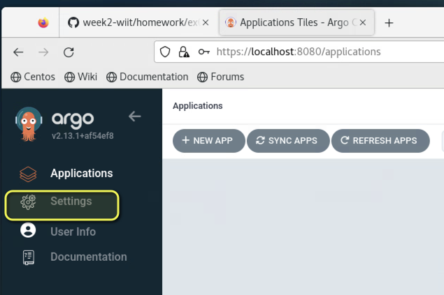
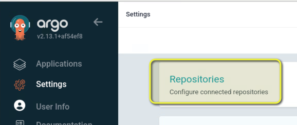
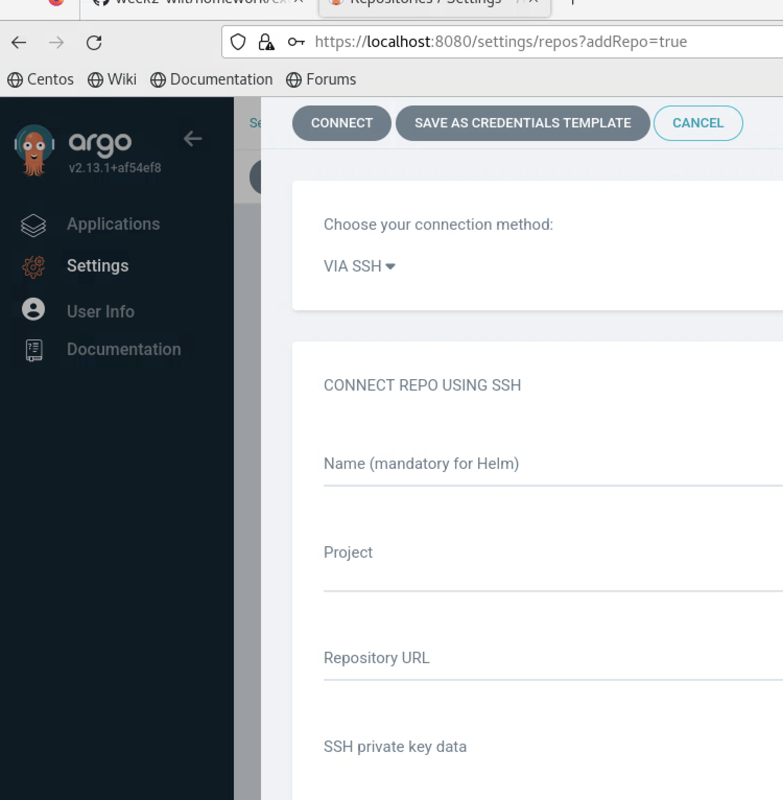
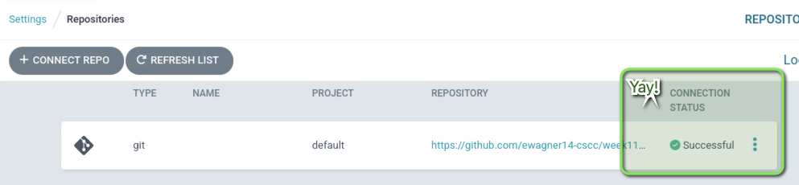
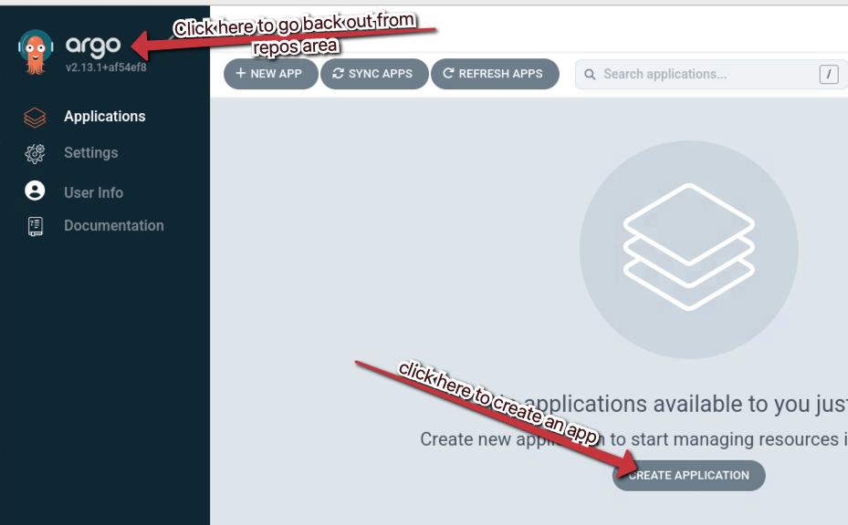
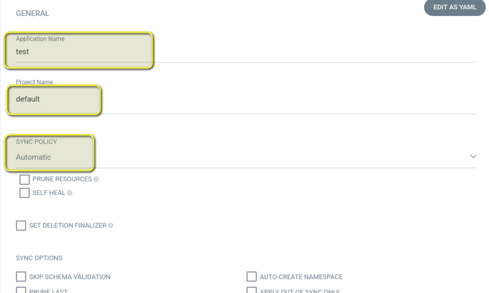
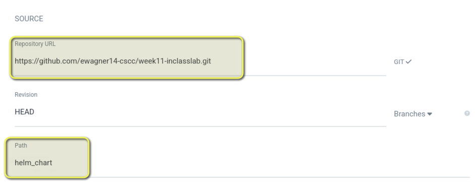
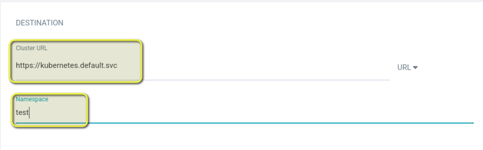
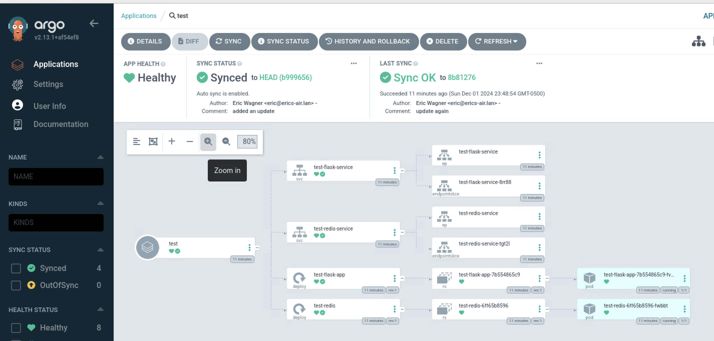

# week 11 inclass activity

We are going to go from docker to CI/CD!

Using python, Dockerfiles, kubernetes services and deployments, helm charts, and finally, completing the CI/CD process with ArgoCD.

##  VM prep

If you are using the CSCC vms, you should start with a fresh working copy of minikube. If you are working on your laptop, a fresh instance of kubernetes may be useful.

```bash
# restart minikube using the fix found a weeks ago so that coredns doesnt break
minikube stop
minikube delete
minikube start --container-runtime=docker --kubernetes-version=1.28.3

#or all together

minikube stop && minikube delete && minikube start --container-runtime=docker --kubernetes-version=1.28.3
```

## Git Repo organization

This exercise builds on itself, so be careful hoping around. There are multiple Dockerfiles, python scripts, and kuberenetes deployments. If you are habitual tab opener (like myself) then double-check what you are editting if you run into issues.

The lab is loosely broken up into 4 steps:

1. Start with Docker
   1. Working on the ```Dockerfile``` in the base of the directory
2. Orchestrate with K8s
   1. Working on the files in the ```manifests``` directory
   2. Pushing images to Azure Container Registry with GitHub Actions
   3. Pulling in images to the minikube environment using a image pull-secret
3. Put it in a Helm Chart
   1. Working on the files in the ```helm-chart``` directory
   2. Reuses the pull-secret and GHA steps
4. Continous Delivery with ArgoCD
   1. Installing ArgoCD with Helm
   2. creating a namespace (ex: test)
   3. Creating a pull-secret for the namespace
   4. Using the ArgoCD UI to sync up the repo with the CRDs in ArgoCD

# Lab work

## Start with Docker 

Edit the ```Dockerfile``` to build the image. See if you can set an ENV to control the config value in the ```Dockerfile```.

*caution! there are two Dockerfiles*

Then run the image with something like below.

```bash
docker run -p 5001:5000 flask-app:latest
```

Can you see your ENV in the output?

## Orchestrate with K8s

Lets edit the files in the ```manifests/``` directory to get a working deployment. Lets also, follow good k8s practices by frontending it with a service. Lets also add a redis key-value store to add a page view component.

This new setup will require you to push to your own github repo and setup GitHub Actions. We will be re-using 90% of the work in [Week 10's GitHub Actions in-class activity](https://github.com/ewagner14-cscc/wiit7501-nana-my-project) so you can use the instructions there to setup 4 values in the settings menu of your repo.

- GitHub Actions Variables
  - ACR_HOST = week9wiit7501.azurecr.io
  - CSCCUID = your CSCC user ID
- GitHub Actions Secrets
  - DOCKER_USER = week9wiit7501
  - DOCKER_PASSWORD = see class chat

### Create a pull-secret

In addition, we will need to setup a pull-secret in our minikube setup to pull images in from the Azure Container Registry (ACR). Note that you will need to provide the password and your email address.

```bash
# Run against your minikube cluster
kubectl create secret docker-registry acr-pull-secret \
    --docker-server=week9wiit7501.azurecr.io \
    --docker-username=week9wiit7501 \
    --docker-password=<password here> \
    --docker-email=<your email addy>@cscc.edu
```

### Edit the manifest files

Explore the files in the ```manifests``` directory and update where needed to deploy the 2 services and 2 deployments.

When it is running, use ```minikube service <svc-name>``` or ```kubectl port-forward``` to view the web page.

Try a few things!

- Use the image from the GitHub actions steps.
  - Think about places you would have to edit to update the images used
- Make sure you let the flask deployment know about the pull-secret! (see below)
  - You can check on the secret using ```kubectl get secrets```
- reload!
  - See how the pages increment. The seperate Redis exists outside the deployment and persists until deleted
- Update the values in the deployment to change the displayed text
  - Update the deployment 

```yaml
spec:
  ...
  template:
  ...
    spec:
      imagePullSecrets:
      - name: acr-pull-secret
```

## Put it in a Helm Chart

In the base of the repo, run ```helm create helm_chart```. Run ```cd helm_chart/templates``` to get in the base directory. 

Now run ```rm -rf *```. Next we copy over all of the files from the ```manifests``` directory.

```bash
# check your path
$ pwd
./week11-inclasslab/helm_chart/templates

# run a quick copy command
cp ../../manifests/* 

# double check your files
$ ls -al
total 32
drwxr-xr-x@ 6 eric  staff  192 Dec  2 14:08 .
drwxr-xr-x@ 7 eric  staff  224 Dec  2 14:04 ..
-rw-r--r--@ 1 eric  staff  663 Dec  2 14:08 dep_app.yaml
-rw-r--r--@ 1 eric  staff  306 Dec  2 14:08 dep_redis.yaml
-rw-r--r--@ 1 eric  staff  158 Dec  2 14:08 svc_app.yaml
-rw-r--r--@ 1 eric  staff  156 Dec  2 14:08 svc_redis.yaml
```
### prep your helm chart

Remember that Helm charts rely on the go templating language, and you need to call out what values we want to control with a ```values.yaml``` file.

*If you get stuck, there is a branch in this repo with solutions*

#### Values file

Lets start with 3 values. Your ```values.yaml``` file is in the base of the ```helm_chart``` directory.

```
configValue: "<what ever you want to say ex:Config from Helm>"
image: <your image id. Check the output >
imagePullSecret: acr-pull-secret
```

1. replace use {{ .Release.Name }}-something where appropriate
2. Don't forget to update ```value: "{{ .Release.Name }}-redis-service" # Redis service name``` so that the Flask app points to the helm chart release Redis and not the previous Redis
3. Look at places where you should add ```{{.Values.configValue}}```
4. Look at places where you should add ```{{.Values.imagePullSecret}}```


```bash
# Here is an example of the redis-service yaml with {{ .Release.Name }} added
apiVersion: v1
kind: Service
metadata:
  name: {{ .Release.Name }}-redis-service
spec:
  selector:
    app: {{ .Release.Name }}-redis
  ports:
  - protocol: TCP
    port: 6379
    targetPort: 6379
```

### install using Helm

Using your helm chart commands, install a release of the application in minikube!

- Are you facing issues?
  - Can you use the clues from ```kubectl describe pod``` commands of ```kubectl logs``` to fix the helm chart?
  - Are you images pulling from ACR?
  - Did any get in on the first try?
- Once you have it deployed, think about how you would make changes?
  - New image files
  - New configs, etc
- Use ```minikube service <svc-name>``` or ```kubectl port-forward``` to view the web page and see that changed values


## Continous Delivery with ArgoCD

Lets complete the process with a Continous Delivery mechanism. We will be using ArgoCD. Let's get it installed using a helm chart of its own.


### ArgoCd prep!

Before we go any further, lets create a new namespace and a new pull-secret for this namespace since those are restricted. (ex: ```kubectl api-resources``` is great!)


```bash
# This is where argocd is going to deploy
kubectl create ns test

# need a new pull-secret in this namespace
kubectl create secret docker-registry acr-pull-secret-argocd -n test \
    --docker-server=week9wiit7501.azurecr.io \
    --docker-username=week9wiit7501 \
    --docker-password=<password here> \
    --docker-email=<your email addy>@cscc.edu

# check the different outputs
kubectl get secrets
kubectl get secrets -n test
```

```bash
# add the argocd helm chart repo to our VM's helm repos
helm repo add argo https://argoproj.github.io/argo-helm

# update the repo list
helm repo update

# create a namespace for argocd
kubectl create namespace argocd

# install argocd to the new namespaces
helm install argocd argo/argo-cd --namespace argocd
```

*This may take 1-3 mins*

At the end you'll get some instructions on working with ArgoCD. (**bonus point** to anyone you brings up where the instructions come from!)

You'll get instructions to get the admin user password. Something like the below:

```bash
kubectl -n argocd get secret argocd-initial-admin-secret -o jsonpath="{.data.password}" | base64 -d
```

Run the command and make note of the output, or the terminal it is in.

### ArgoCD UI access

In another terminal, ```kubectl port-forward``` to the argocd service. You can also use ```minikube service```. the instructions will spit out something like this.

```bash
kubectl port-forward service/argocd-server -n argocd 8080:443
```

Open up the ArgoCd UI in ```http://localhost:8080``` in a web browser. *Click through the warnings*

Use ```admin``` as the username and the password from the output in the other terminal.

Now, lets add to the helm chart and update the values pull secret

### Setting up a repo in ArgoCD

Now that we are logged into ArgoCD, we can setup our GitHub repo. *make sure it is public*

Click into the settings menu



Click repos



Then click connect repo, and you will get a screen like this



In this menu will want to fill out the following

- choose your connection method
  - click drop down, and select "via HTTPS"
- Project
  - select default
- Repository URL
  - paste your GitHub repo (ex: https://github.com/ewagner14-cscc/week11-inclasslab.git)

Then click connect

You should see a Successful connection status



#### Setting up the helm chart in ArgoCD

Click back out to the main argocd app

And the click on the "create application" button



A lot of options in the next menu screen. Fill out the following in the labeled sections

The first section is "General"

- App name
  - test
- Project name
  - default
- Sync policy
  - click drop down and select "Automatic"



The next section is source.

- Repo URL
  - Click the drop down and you will be able to select the repo we added
- path
  - type in the path of the helm chart in the GitHub repo (ex: helm_chart)



The next section is destination settings. Here we select the local k8s cluster in the minikube and the namespace.

- cluster URL
  - https://kubernetes.default.svc
- namespace
  - test



We do not need to edit the helm chart area. It should be good.

#### Deploy!

If your test namespace is created and you have the argocd image pull secret ready, you should be good to go.



Try making some changes to the GitHub repo

- edit your values.yaml locallly
  - change the configValue to edit the text.
  - update the redis image
- change the templates to add a ```{{ .Values.replicas }}``` and add to the values file
  - edit the replicaes and see the changes get pulled into ArgoCD
- check your minikube pod numbers and namespaces